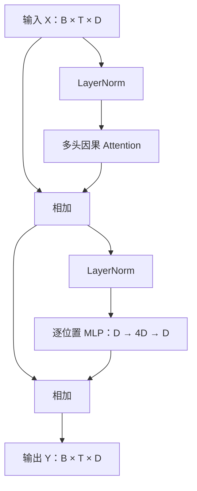

上一版更像结构概览，省略了很多“为什么要这样做”的中间步骤。尤其是从 MLP 跳到 Q、K、V，再跳到训练，容易让公式看起来像一组需要记住的规定。

这次我们从你已经理解的 MLP 出发，逐步构造一个 Transformer。先讲 GPT 式的因果语言模型，把工作原理、训练和实现贯通，再说明原始 Transformer 的编码器和解码器。

整个过程中，请始终区分两件事：**网络怎样处理信息，以及训练怎样让网络学会处理信息。**

---

你熟悉的 MLP，大致可以写成：

\[
f(x)=\sigma(xW_1+b_1)W_2+b_2
\]

这里把 \(x\) 写成行向量，所以线性变换写作 \(xW\)。如果你习惯 \(Wx\)，只是记号约定不同。

MLP 的工作是：接收一个特征向量，通过线性变换和非线性激活，把输入特征组合成新的表示。训练则根据输出误差，调整这些变换的参数。

现在考虑一句话：

```text
小猫    累了    所以    它    睡着了
```

为了说明原理，我们暂时把这五个词视为五个 token。真实 tokenizer 可能把它们拆成其他单位。

我们首先需要把它们变成数字。但直接写成：

```text
17    6    31    8    22
```

还不够。这些编号只是身份标记，“31”没有比“6”多出什么语义，编号相近也不代表意思相近。

因此，我们建立一张可学习的表：

\[
E\in\mathbb R^{C\times D}
\]

其中 \(C\) 是词表大小，\(D\) 是表示维度。每个 token 对应表里的一行：

\[
x_i=E[\text{token}_i]
\]

这就是 Embedding。它可以理解为：**为每个离散 token 保存一组可训练的特征。**这些特征通常从随机数开始，随着训练逐渐改变；每一个维度并没有预先指定的语言学含义。查表也等价于用 token 的 one-hot 向量乘这张矩阵，只是查表更直接。[PyTorch Embedding 文档](https://docs.pytorch.org/docs/2.14/generated/torch.nn.Embedding.html)

五个 token 就变成五行向量：

\[
X=
\begin{bmatrix}
x_1\\
x_2\\
x_3\\
x_4\\
x_5
\end{bmatrix}
\in\mathbb R^{5\times D}
\]

**Transformer 会一直保留这种“一排向量”的组织方式。**每个位置都有自己的表示，而不是一开始就把整句话压成一个向量。

实际计算通常还同时处理多句话，所以输入形状是：

\[
[B,T,D]
\]

这里 \(B\) 是 batch 中的序列数量，\(T\) 是每条序列的长度，\(D\) 是每个位置的特征维度。

---

**先把你熟悉的 MLP 放到每个位置上，看看它缺少什么。**

我们可以对五行分别执行同一个 MLP：

\[
y_i=f(x_i)
\]

参数在所有位置共享，但：

\[
y_4=f(x_4)
\]

仍然只依赖第四个位置的输入。

如果第四个 token 是“它”，这个 MLP 能加工“它”的向量，却不能通过这一步知道前面出现了“小猫”。

这不是说一般的 MLP 无法处理词与词的关系。我们当然可以把整句话的向量拼接起来：

\[
[x_1,x_2,x_3,x_4,x_5]
\]

再交给一个大 MLP。这样不同位置就能相互影响。但这种直接做法与预设长度和位置布局绑定，输入长度变化时也需要额外处理。

Transformer 采用另一种组织方式：

**用一个操作让不同位置交换信息，再用共享 MLP 加工每个位置得到的信息。**

负责交换信息的操作，就是 Attention。

---

**理解 Attention，可以先不碰 Q、K、V，只考虑我们希望得到什么。**

更新“它”所在位置时，我们希望它能够从其他位置收集有用的信息。例如，“小猫”可能提供它所指代的对象，“累了”可能提供这个对象的状态。

最简单的汇总方式，是把所有位置求平均：

\[
z_i=\frac1T\sum_{j=1}^{T}x_j
\]

但这有一个问题：无论更新哪个位置，都获得同样的混合结果；无论句子内容是什么，都按同样比例混合。

我们需要更灵活的形式：

\[
z_i=\sum_{j=1}^{T}a_{ij}v_j
\]

这里：

- \(v_j\) 是位置 \(j\) 提供的信息。
- \(a_{ij}\) 是更新位置 \(i\) 时，给位置 \(j\) 的权重。

现在关键问题变成：**这些权重怎样得到？**

如果 \(a_{ij}\) 只是固定参数，那么更新第四个位置时，永远按同样比例读取第一、第二、第三个位置。

Attention 让权重取决于当前内容：

\[
a_{ij}=g(x_i,x_j)
\]

换一段输入，权重就可能改变。模型需要学习的是“怎样根据内容计算匹配”，而不是为每一对固定位置保存一个永久权重。

因此，Attention 中有两种容易混淆的“权重”：

| 对象 | 是什么 | 什么时候改变 |
|---|---|---|
| \(W_Q,W_K,W_V\) 等 | 模型保存的参数 | 训练时由优化器更新 |
| \(A=(a_{ij})\) | 本次输入产生的中间结果 | 每次前向计算都重新得到 |

生成文本时，模型参数通常固定，但注意力权重仍然会随着输入内容改变。

---

**Q、K、V，是把“决定读哪里”和“实际读什么”分开。**

每个位置经过三个线性变换：

\[
q_i=x_iW_Q,\qquad
k_i=x_iW_K,\qquad
v_i=x_iW_V
\]

它们的职责是：

- \(q_i\)：当前位置用什么特征去匹配其他位置。
- \(k_j\)：位置 \(j\) 提供什么特征供匹配。
- \(v_j\)：位置 \(j\) 实际提供什么信息供汇总。

可以借用检索系统的直觉：Q 类似检索请求，K 类似供检索的索引，V 类似检索之后取出的内容。但它们全部是向量，并不是人为填写的“问题”“标签”和“答案”。

为什么匹配与内容要分开？

因为**决定一个位置是否相关的特征，与这个位置值得传递的信息，可能不同。**

例如，处理代词时，某些特征可能有助于匹配前面的对象；找到相关对象后，模型又可能需要汇总它的状态、属性等信息。独立投影给模型提供这种自由度，但不会预先规定它必须按这种人类描述来分工。

Q 与 K 分开，也让匹配关系可以具有方向性。“位置 \(i\) 想从位置 \(j\) 读取什么”，不必与“位置 \(j\) 想从位置 \(i\) 读取什么”相同。

现在可以计算匹配分数：

\[
s_{ij}=\frac{q_i\cdot k_j}{\sqrt{d_k}}
\]

其中 \(d_k\) 是 Q、K 的维度。

点积把两组特征组合成一个标量。这里更准确的说法是“可学习的匹配分数”，不能简单等同于两个词的语义相似度。

然后，对当前位置的所有候选分数做 softmax：

\[
a_{ij}
=
\frac{\exp(s_{ij})}
{\sum_{m=1}^{T}\exp(s_{im})}
\]

这样，每一行的权重都非负，并且加起来等于 1。最后：

\[
z_i=\sum_j a_{ij}v_j
\]

把所有位置一起写成矩阵，就是：

\[
Q=XW_Q,\qquad K=XW_K,\qquad V=XW_V
\]

\[
S=\frac{QK^\top}{\sqrt{d_k}}
\]

\[
A=\operatorname{softmax}_{\text{每行}}(S)
\]

\[
Z=AV
\]

矩阵形状也解释了这些操作：

\[
[T,d_k]\times[d_k,T]=[T,T]
\]

所以 \(QK^\top\) 的每个元素，都是“一个查询位置与一个候选位置”的匹配分数。

再计算：

\[
[T,T]\times[T,d_v]=[T,d_v]
\]

就把各位置的 Value 汇总成新的位置表示。[PyTorch Attention 文档](https://docs.pytorch.org/docs/2.14/generated/torch.nn.functional.scaled_dot_product_attention.html)

注意，**这里的 softmax 是在分配“读取位置的权重”，还没有在预测下一个词。**预测词表概率时，后面会出现另一个 softmax。

---

**我们实际算一次，就能看清 Attention 做了什么。**

暂时假设三个位置经过投影后，第三个位置的查询是：

\[
q_3=(1,0)
\]

候选位置提供的 Key 和 Value 如下。这些数字只是教学用的构造，不代表某句话的真实语义：

| 位置 | Key | Value |
|---|---|---|
| 1 | \((1,0)\) | \((1,0)\) |
| 2 | \((0,1)\) | \((0,2)\) |
| 3 | \((1,1)\) | \((3,1)\) |

首先，Q 与每个 K 做点积：

\[
q_3\cdot k_1=1,\qquad
q_3\cdot k_2=0,\qquad
q_3\cdot k_3=1
\]

Key 的维度是 2，所以缩放后：

\[
s_3
=\frac{(1,0,1)}{\sqrt2}
\approx(0.707,0,0.707)
\]

softmax 后：

\[
a_3\approx(0.401,0.198,0.401)
\]

最后汇总 Value：

\[
\begin{aligned}
z_3
&=0.401(1,0)+0.198(0,2)+0.401(3,1)\\
&\approx(1.604,\;0.797)
\end{aligned}
\]

第三个位置得到了一组来自多个位置的信息。

这个例子中，网络没有硬选一个位置。它保留了多个位置的贡献，只是比例不同。比较的是 Q 与 K，传递的则是 V。

如果把查询换成：

\[
q_3=(0,1)
\]

其他 K、V 保持不变，那么权重会变成：

\[
a_3\approx(0.198,0.401,0.401)
\]

同一组候选内容，因为查询改变，混合比例就改变了。

缩放因子 \(\sqrt{d_k}\) 也可以从这里理解。点积是许多项乘积的和；在常见的简化统计假设下，维度越高，点积分数的波动越大。分数差距过大，softmax 容易变得非常尖锐，相关梯度也可能变小。除以 \(\sqrt{d_k}\)，是为了控制这种随维度增长的尺度变化。

---

**如果模型要预测未来，我们还必须限制信息能往哪个方向流动。**

假设输入是：

```text
我    喜欢    机器    学习
```

“喜欢”所在位置要预测“机器”。如果它能直接读取后面的“机器”，就已经看到了答案。

因此，因果 Attention 规定：位置 \(i\) 只能读取位置 \(j\le i\)。

允许读取的关系是：

```text
                 被读取的位置
                 1  2  3  4
查询位置 1        ✓  ×  ×  ×
查询位置 2        ✓  ✓  ×  ×
查询位置 3        ✓  ✓  ✓  ×
查询位置 4        ✓  ✓  ✓  ✓
```

这张表表示“是否允许”，不是实际注意力权重。

实现时，在 softmax 之前给未来位置加上 \(-\infty\)：

\[
M_{ij}=
\begin{cases}
0,&j\le i\\
-\infty,&j>i
\end{cases}
\]

\[
A=\operatorname{softmax}_{\text{每行}}
\left(\frac{QK^\top}{\sqrt{d_k}}+M\right)
\]

因为 \(e^{-\infty}=0\)，禁止位置的权重就会成为零。

位置可以读取自身，这是合理的：当前位置的 token 已经出现，模型要预测的是它后面的 token。

第一个位置只有自己可读，所以在没有注意力 dropout 的这个简单例子里，它给自己的权重必然是 100%。这反映的是遮罩约束，不是模型发现第一个词特别重要。

---

**单头只有一套匹配方式，多头让模型同时使用多套匹配方式。**

对同一排输入向量，分别进行多组投影：

\[
\operatorname{head}_r
=
\operatorname{Attention}
\left(XW_Q^{(r)},XW_K^{(r)},XW_V^{(r)}\right)
\]

每个头都有自己的匹配分数和注意力权重。然后把输出拼接起来，再做一次线性变换：

\[
\operatorname{MHA}(X)
=
\operatorname{Concat}
(\operatorname{head}_1,\ldots,\operatorname{head}_H)W_O
\]

这里的目的，是允许同一个位置通过不同的投影，同时收集不同的信息。

但不要把头数理解成预先规定的语言学分工。训练没有明确指定“第一个头负责主语，第二个头负责情绪”。

常见实现把总维度分配给多个头。例如：

\[
D=64,\qquad H=4,\qquad d_h=16
\]

每个头输出 16 维，四个头拼接后回到 64 维。

这里还有一个容易误解的细节：**每个头通常先从完整的输入向量投影出自己的特征，并不是只允许它看原始向量中固定的一小块。**代码中的“拆成多个头”，发生在投影之后。[PyTorch 多头注意力文档](https://docs.pytorch.org/docs/2.14/generated/torch.nn.MultiheadAttention.html)

多头与多层也不同：多头是在同一层并行收集信息；多层是在前一层结果的基础上继续加工信息。

---

**Attention 之后，再接回你熟悉的 MLP。**

Attention 已经让“它”的表示获得了上下文，但这些信息还需要进一步组合和加工。

一个常见的前馈网络是：

\[
\operatorname{FFN}(u)
=
\phi(uW_1+b_1)W_2+b_2
\]

例如维度变化：

\[
64\rightarrow256\rightarrow64
\]

先扩展特征维度，用激活函数做非线性变换，再投影回原维度。

这个 MLP 对每个位置独立执行，同一层的所有位置共享参数；不同层通常有各自的参数。

它本身没有在不同位置之间交换信息，但它的输入已经包含 Attention 汇总来的上下文。所以，**“逐位置计算”不等于“输出与上下文无关”。**

一个常见的 Transformer 模块还加入残差连接和 LayerNorm：

\[
H=X+\operatorname{MHA}(\operatorname{LN}(X))
\]

\[
Y=H+\operatorname{FFN}(\operatorname{LN}(H))
\]

这是 Pre-LN 形式。

残差连接让子模块在已有表示上添加更新：

\[
Y=X+F(X)
\]

这样既保留了原输入，也给梯度提供了直接路径。如果从求导来看：

\[
\frac{\partial Y}{\partial X}
=
I+\frac{\partial F}{\partial X}
\]

其中的 \(I\) 就来自这条直接连接。它有助于优化深层网络，但并不保证所有训练问题都自动消失。

LayerNorm 则对**一个位置内部的特征维度**计算均值和方差：

\[
\operatorname{LN}(x)
=
\gamma\odot
\frac{x-\mu}{\sqrt{\sigma^2+\epsilon}}
+\beta
\]

对于形状 \([B,T,D]\) 的输入，常见的 `LayerNorm(D)` 是分别规范每个位置的 D 个特征；它不会把整句话所有位置混在一起求平均。\(\gamma,\beta\) 也是可学习参数。[PyTorch LayerNorm 文档](https://docs.pytorch.org/docs/2.14/generated/torch.nn.LayerNorm.html)

一个模块的信息路径如下：



原始 Transformer 把归一化放在残差相加之后，属于 Post-LN。这里使用 Pre-LN，是为了讲解和实现一类常见变体，不能把二者的顺序混为一谈。[归一化位置的研究](https://arxiv.org/abs/2002.04745)

---

**堆叠多层，意味着每一层都在读取上一层加工过的表示。**

第一层 Attention 读取的是初始 token 表示；下一层读取的，则已经是经历过 Attention 和 MLP 的表示。

所以，第二层读取“小猫”所在位置时，读取到的可能已经包含前面某些上下文，而不只是初始“小猫”词向量。

每一层都可以重新计算：

- 当前需要匹配什么特征。
- 哪些位置提供了相关信息。
- 这些位置应传递什么内容。
- 汇总后怎样继续加工。

这就是多层网络能够组合关系的原因。各层具体学到什么，取决于参数、数据和训练任务，不能固定地说“第一层只学词义，第二层只学语法”。

还需要补上位置机制。对于没有位置相关机制、也没有顺序相关遮罩的标准 self-attention，重新排列输入行，输出也会相应重新排列；它没有额外获得明确的位置坐标。

入门实现可以使用可学习的位置表：

\[
x_i
=
E[\text{token}_i]+P[i]
\]

模型由此获得“当前位置是什么内容”和“它位于哪里”的信息。因果遮罩本身也提供了一部分顺序结构，因此不能绝对地说没有位置 Embedding 就完全不知道顺序。位置机制进一步提供明确的位置表示；实际模型也可能使用正弦编码、RoPE 等其他方式。

经过多层模块后，每个位置仍然是一个 D 维向量：

\[
h_t\in\mathbb R^D
\]

为了预测下一个 token，再接一个线性分类器：

\[
s_t=h_tW_{\text{out}}+b
\]

其中：

\[
W_{\text{out}}\in\mathbb R^{D\times C}
\]

\(s_t\) 包含词表中 C 个 token 的分数，也就是 logits。然后：

\[
p_{t,j}
=
\frac{\exp(s_{t,j})}
{\sum_{k=1}^{C}\exp(s_{t,k})}
\]

这才是“下一个 token 的概率分布”。

因此，有两个不同的概率分配过程：Attention 的 softmax 分配读取位置的权重；输出层的 softmax 分配词表中各 token 的预测概率。

---

**现在进入训练：先把一段文本展开成你熟悉的监督学习样本。**

考虑：

```text
<BOS>    我    喜欢    机器    学习    <EOS>
```

这里用开始和结束标记便于说明，具体模型如何使用特殊 token 可以不同。

这段文本可以提供五个训练任务：

| 已知前缀 | 应预测的下一个 token |
|---|---|
| `<BOS>` | 我 |
| `<BOS> 我` | 喜欢 |
| `<BOS> 我 喜欢` | 机器 |
| `<BOS> 我 喜欢 机器` | 学习 |
| `<BOS> 我 喜欢 机器 学习` | `<EOS>` |

我们希望模型学习：

\[
P_\theta(x_{t+1}\mid x_1,\ldots,x_t)
\]

这是一种条件概率：给定已经出现的内容，下一个 token 有多大概率是什么。

训练标签直接来自文本自身，所以不需要人工为每一个前缀单独填写答案。把同一段序列错开一位即可：

```text
输入：<BOS>    我      喜欢    机器    学习
目标：我       喜欢    机器    学习    <EOS>
```

对应：

```python
inputs = tokens[:-1]
targets = tokens[1:]
```

这叫自监督学习。它有明确的监督目标，只是标签由数据自身构造。[因果语言模型训练说明](https://huggingface.co/docs/transformers/tasks/language_modeling)

在“喜欢”所在位置，输出层应该提高“机器”的概率。如果真实下一个 token 为 \(y_t\)，损失就是：

\[
\mathcal L_t=-\log p_{t,y_t}
\]

例如，给正确答案的概率是 0.1：

\[
-\log(0.1)\approx2.303
\]

概率提高到 0.7：

\[
-\log(0.7)\approx0.357
\]

正确答案概率越高，损失越低。整个序列通常取各有效位置损失的平均：

\[
\mathcal L
=
-\frac1T\sum_t
\log P_\theta(x_{t+1}\mid x_1,\ldots,x_t)
\]

这就是常见的 next-token 训练目标。[GPT 论文中的语言模型目标](https://cdn.openai.com/research-covers/language-unsupervised/language_understanding_paper.pdf)

同一前缀可能有多个合理延续。训练数据记录了某一次实际出现的延续；模型通过大量这样的例子，学习不同延续的统计规律。

---

**损失怎样让 Attention 学会读取有用信息？仍然靠反向传播。**

你可以从输出端开始理解。

对一个位置，交叉熵对 logits 的梯度是：

\[
\frac{\partial\mathcal L_t}{\partial s_{t,j}}
=
p_{t,j}-\mathbf1[j=y_t]
\]

假设正确 token 的概率是 0.2，那么对应梯度为：

\[
0.2-1=-0.8
\]

如果直接对这个 logit 做梯度下降，它会被提高。某个错误 token 的概率为 0.4，梯度则为：

\[
0.4-0=0.4
\]

直接对这个 logit 做梯度下降，它会被降低。

实际优化器更新的是模型参数，所以这个误差信号会继续通过链式法则传回：

```text
词表输出层
→ 最后的隐藏表示
→ 各层 MLP 与 Attention
→ token 和位置 Embedding
```

Attention 的输出依赖 V；汇总权重依赖 Q 与 K。因此，三个投影矩阵都能获得梯度。

训练不需要直接告诉模型“这个头应该关注小猫”。它告诉整个网络的是：**在这个前缀下，下一个 token 预测得怎么样。**有助于降低损失的内部信息处理方式，会通过参数更新逐渐形成。

被更新的包括 Embedding、各层投影矩阵、MLP、LayerNorm 的可学习参数，以及输出层。注意力矩阵 A 是中间计算结果，梯度会经过它，但优化器不会把它当作一张永久的参数表保存下来。

---

**并行训练与逐步生成的区别，来自“历史 token 是否已经给定”。**

训练时，整段真实文本已经存在。

即使模型在“喜欢”后面错预测了“音乐”，后面的训练位置仍然接收真实文本中的“机器”，不会把“音乐”替换进这一次计算。

这种使用真实历史输入的方式叫 teacher forcing。[PyTorch 对 teacher forcing 的说明](https://docs.pytorch.org/tutorials/intermediate/seq2seq_translation_tutorial.html)

既然所有真实历史 token 已知，同一层的所有位置就可以放在一个矩阵里一起计算。每个位置通过因果遮罩，获得自己的合法前缀：

```text
<BOS>    我      喜欢    机器    学习
  ↓      ↓        ↓       ↓       ↓
预测我   预测喜欢  预测机器  预测学习  预测结束
```

层与层之间仍然存在先后依赖；并行的是同一层中的不同位置。

整段输入同时存在，会不会让未来信息绕过遮罩，从其他层泄漏回来？

只要每一层都保持因果性，就不会：

假设上一层的位置 \(j\) 只包含位置 \(1,\ldots,j\) 的信息。下一层的位置 \(i\) 只能读取 \(j\le i\) 的位置，因此汇总来的信息仍然只来自 \(1,\ldots,i\)。

MLP、常用的 LayerNorm 和残差连接，都只在同一位置处理或传递信息，也不会额外引入未来位置。

所以，这个约束可以逐层保持。

生成时，情况不同。模型只有：

```text
我    喜欢
```

后面的真实 token 尚未给定。它必须先取得最后一个位置的输出概率，选择一个 token，例如“机器”，再把这个 token 接回输入：

```text
我    喜欢    机器
```

然后才能预测下一步。

生成时改变的是输入前缀，参数通常固定，也不需要反向传播。已知提示词可以并行处理，但通常的自回归续写要逐 token 推进。

KV cache 是建立在这条因果性上的优化：已有位置不会因为后来追加 token 而改变，因此可以缓存各层历史位置的 K、V。新 token 到来时，计算它自己的表示，并读取历史缓存，减少重复计算。

---

**原始 Transformer 还包含另一条输入信息来源。**

上面讲的是 GPT 式 decoder-only 模型。原始 Transformer 用于翻译等任务，包含编码器和解码器。

例如：

```text
英文输入 → Encoder → 一排输入表示
                         ↓
已有中文输出 → Decoder → 下一个中文 token
```

Encoder 读取完整输入句子，使用双向 self-attention，输出每个输入位置的表示。它不是必须把整句压成一个向量。

Decoder 中有三个主要子模块：

1. 因果 self-attention：读取已经出现的目标语言 token。
2. Cross-attention：读取 Encoder 输出。
3. 逐位置 MLP：加工汇总后的信息。

Cross-attention 仍然使用同样的计算形式，只是来源变了：

\[
Q=\text{Decoder 当前表示的投影}
\]

\[
K,V=\text{Encoder 输出的投影}
\]

于是，解码器既知道“已经翻译了什么”，也能读取“原句说了什么”。[原始 Transformer 架构](https://arxiv.org/html/1706.03762v7)

Encoder-only 模型则可以用双向信息训练被遮住 token 的恢复，例如 BERT。[BERT 论文](https://arxiv.org/abs/1810.04805)

因此，**Transformer 是组织信息流动的架构；预测下一个 token，是我们选择的一种训练任务。**从头训练与微调也不是两种新的网络结构：前者从初始化参数开始学习，后者从已有参数继续学习。

---

**把以上过程落到代码，最重要的是跟住每一步的数据形状。**

我整理了一个完整的[教学用字符级 Transformer 实现](~/.codex/visualizations/2026/10/01/01a0f990-244e-79f0-8544-38ab003545f9/minimal_transformer.py)。

它采用：

- 表示维度 \(D=64\)。
- 注意力头数 \(H=4\)，每头维度 \(d_h=16\)。
- 两层 Transformer 模块。
- 最长 32 个字符的上下文。
- 手写因果 Attention、训练循环和逐字符生成。

前面的例子为了说明语言关系，暂时按词划分 token；这个实现用字符作为 token，使你可以先专注于网络计算。

核心 Attention 代码如下。这是脚本中 `forward` 的主体，相关线性层和遮罩在初始化时建立：

```python
batch, time, dim = x.shape                 # [B, T, D]

q, k, v = self.qkv(x).chunk(3, dim=-1)      # 各为 [B, T, D]

q = q.reshape(batch, time, self.n_heads, self.head_dim).transpose(1, 2)
k = k.reshape(batch, time, self.n_heads, self.head_dim).transpose(1, 2)
v = v.reshape(batch, time, self.n_heads, self.head_dim).transpose(1, 2)
# 现在各为 [B, H, T, dh]

scores = (q @ k.transpose(-2, -1)) / math.sqrt(self.head_dim)
# [B, H, T, T]

scores = scores.masked_fill(
    ~self.causal_mask[:, :, :time, :time],
    float("-inf"),
)

weights = F.softmax(scores, dim=-1)

mixed = weights @ v                       # [B, H, T, dh]

mixed = mixed.transpose(1, 2).contiguous().view(batch, time, dim)
# 合并各头：[B, T, D]

return self.output(mixed)
```

逐行对应一下：

`self.qkv` 是从 D 维到 3D 维的线性层。它把三个投影合并成一次计算，再拆出 Q、K、V。

`reshape` 把每个投影结果的 D 维组织成 H 个头；`transpose` 调整轴顺序，让矩阵乘法能对每个 batch、每个头独立执行。

`q @ k.transpose(-2, -1)` 中真正相乘的是：

\[
[T,d_h]\times[d_h,T]
\]

因此产生 \([T,T]\) 的匹配分数。缩放用的是**每个头的维度** \(d_h\)，不是总维度 D。

`softmax(dim=-1)` 沿最后一个轴，也就是被读取的位置，分别归一化每个查询的权重。

`weights @ v` 汇总内容；最后把多个头重新合并，并用输出投影加工。

整条形状路径是：

\[
[B,T,D]
\rightarrow[B,H,T,d_h]
\rightarrow[B,H,T,T]
\rightarrow[B,H,T,d_h]
\rightarrow[B,T,D]
\]

标准完整 Attention 要计算位置之间的两两匹配。因此，序列长度翻倍时，这部分位置对数量会变为四倍。这也是长上下文计算成本的重要来源。

模块内部对应前面的两行公式：

```python
x = x + self.attention(self.ln_attention(x))
x = x + self.ffn(self.ln_ffn(x))
```

整个模型先查 token 与位置 Embedding，再经过这些模块，最后执行：

```python
logits = self.lm_head(self.final_ln(x))
```

它产生：

\[
[B,T,C]
\]

也就是每个样本、每个位置，对词表中每个 token 的分数。

训练时，输入与标签已经提前错开一位。损失计算可以写成：

```python
loss = F.cross_entropy(
    logits.reshape(-1, vocab_size),
    targets.reshape(-1),
)
```

这相当于把 \(B\times T\) 个位置展开，作为一批分类问题一起计算。这里应传入原始 logits，因为 `cross_entropy` 内部已经包含数值稳定的 log-softmax。[PyTorch 交叉熵文档](https://docs.pytorch.org/docs/2.14/generated/torch.nn.CrossEntropyLoss.html)

参数更新仍然是熟悉的过程：

```python
optimizer.zero_grad(set_to_none=True)
loss.backward()
optimizer.step()
```

脚本还包含独立验证文本的损失计算。验证使用真实前缀和因果遮罩，但不更新参数。训练损失下降，只说明模型越来越适应训练数据；验证损失帮助我们观察它对未参与更新的文本表现如何。

这个完整示例已经通过 Python 语法检查；手算例子的数值也已核算。当前环境没有 PyTorch，因此训练和自检尚未运行，不能把代码中的预期结果当作已观察到的结果。

理解代码时，最有价值的两个实验是：

1. **修改未来字符，检查此前位置的输出是否保持不变。**这直接检验因果遮罩，以及整个网络有没有其他泄漏路径。
2. **反复训练同一个很小的 batch，观察损失是否明显下降。**这检查从输入、前向计算、标签到反向传播和参数更新是否贯通。

脚本的 `--self-check` 包含这两项检查。先观察它怎样处理一排向量，再观察这些向量怎样影响词表预测，你就能把“架构图里的模块”与“实际运行中的计算”对应起来。
